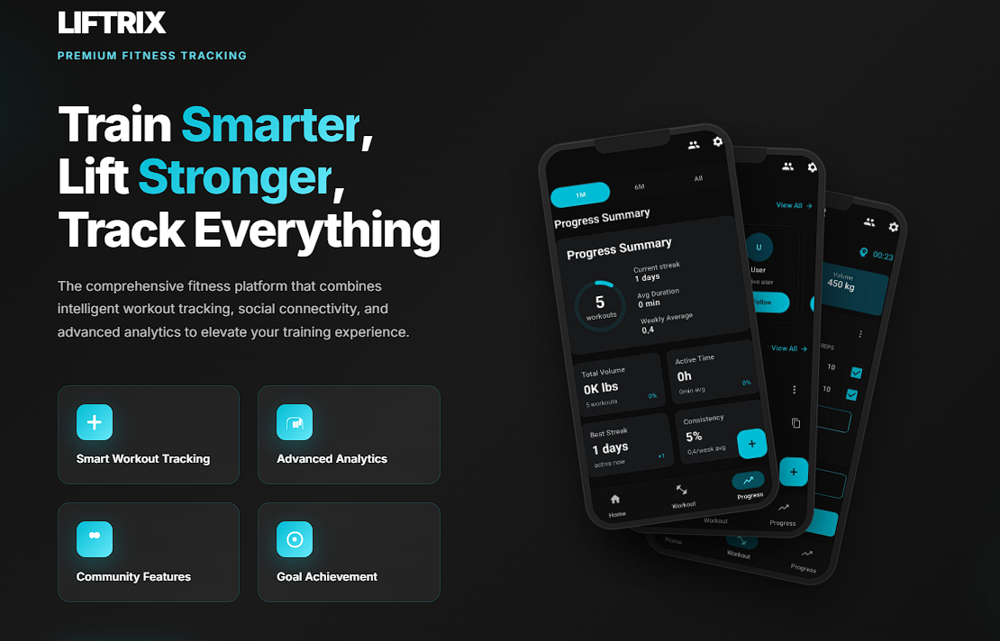
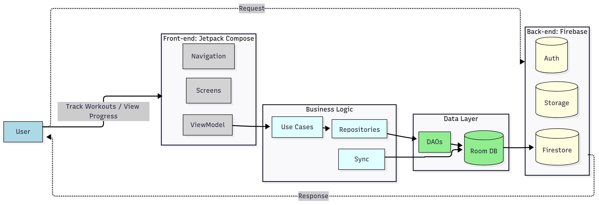
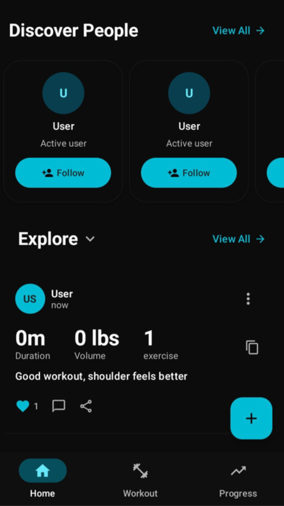
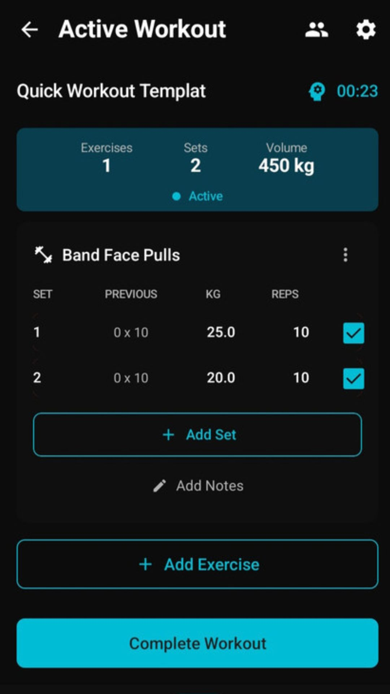
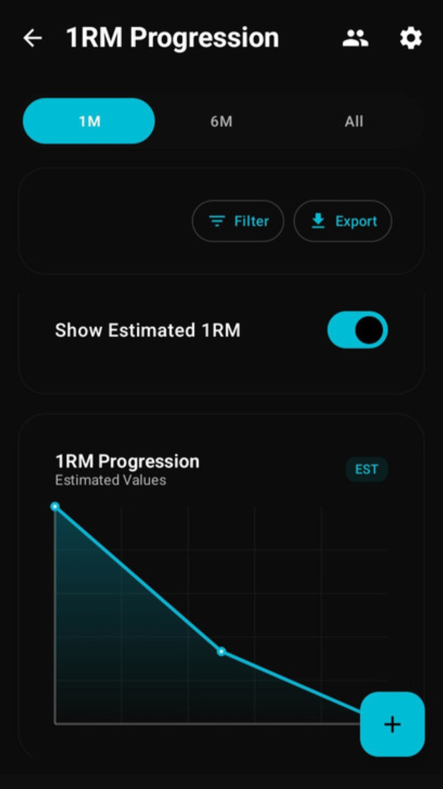
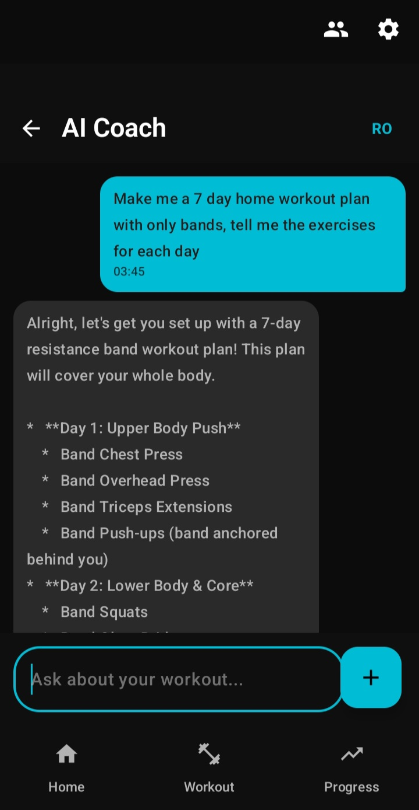

<div align="center">
  
# 💪 Liftrix

### Android Fitness Tracking App with AI Coaching & Social Engagement

[](https://developer.android.com)
[](https://kotlinlang.org)
[](https://developer.android.com/studio/releases/platforms#8.0)
[](https://developer.android.com/studio/releases/platforms)
[](LICENSE)

[](https://developer.android.com/jetpack/compose)
[](https://firebase.google.com)
[](https://developer.android.com/topic/architecture)
[](https://developer.android.com/topic/architecture/data-layer/offline-first)



*Transform your fitness journey with intelligent workout tracking, AI-powered coaching, and social motivation*

[**📱 Demo**](#demo) • [**🚀 Quick Start**](#quick-start) • [**📖 Documentation**](#documentation) • [**🤝 Contributing**](#contributing)

</div> 

---

## ✨ Overview

**Liftrix** is an Android fitness app that combines workout tracking, progress analytics, social engagement and AI-powered coaching. It uses a modular, testable architecture with offline-first persistence and Firebase-backed synchronization.

### 🎯 Key Highlights

- **🏗️ Clean Architecture**: layered UI, ViewModel, use case, repository and data boundaries
- **📱 Modern UI**: 100% Jetpack Compose with Material 3 design system
- **🔄 Offline-First**: Room database as source of truth with Firebase sync
- **🤖 AI Integration**: Gemini 2.5 Flash Lite for intelligent coaching
- **👥 Social Features**: Privacy-first feed system with engagement tracking
- **📊 Advanced Analytics**: progress widgets and charts optimized for fluid rendering
- **🔐 Security**: User-scoped data isolation and privacy controls


---

## 🚀 Quick Start

### Prerequisites

- **Android Studio** Jellyfish (2023.3.1) or later
- **JDK 17+** (OpenJDK recommended)
- **Android SDK** API 34
- **16GB RAM** minimum (32GB recommended)

### Installation

```bash
# Clone the repository
git clone https://github.com/valentin5643/LiftrixApp.git
cd liftrix

# Verify Gradle wrapper
./gradlew --version

# Download dependencies
./gradlew dependencies

# Build debug APK
./gradlew assembleDebug
```

### Firebase Setup

1. Create a new Firebase project at [console.firebase.google.com](https://console.firebase.google.com)
2. Enable required services:
   - Authentication (Email/Google/Anonymous)
   - Firestore Database
   - Storage
   - Analytics, Performance, Crashlytics
   - Remote Config
   - Firebase AI (Gemini)
3. Download `google-services.json` and place in `app/` directory
4. Deploy security rules:

```bash
firebase init
firebase deploy --only firestore:rules storage:rules
```

### Run the App

```bash
# Install on connected device/emulator
./gradlew installDebug

# Run with live logs
adb logcat -s Liftrix:V
```

---

## 🏗️ Architecture

<div align="center">

</div>

### Clean Architecture Layers

```
UI Layer (Jetpack Compose)
    ↓ StateFlow<UiState<T>>
ViewModel Layer (MVI Pattern)
    ↓ LiftrixResult<T>
Use Case Layer
    ↓ Domain Models
Repository Layer
    ↓ Flow<Entity>
DAO Layer
    ↓ SQL Queries
Room Database
    ↓ Background Sync
Firebase Services (8 Integrated)
```

### Key Architectural Patterns

- **🎯 MVVM with MVI**: Unidirectional data flow with event handling
- **🔒 User Scoping**: Mandatory userId filtering for data security
- **🔄 Offline-First**: Room as single source of truth
- **⚡ Type-Safe Navigation**: Serializable routes with compile-time safety
- **💉 Dependency Injection**: Hilt modules for clean separation

---

## 🛠️ Tech Stack

<table>
<tr>
<td align="center" width="96">

<br>Kotlin
</td>
<td align="center" width="96">

<br>Compose
</td>
<td align="center" width="96">

<br>Firebase
</td>
<td align="center" width="96">

<br>Android
</td>
<td align="center" width="96">

<br>Hilt
</td>
<td align="center" width="96">

<br>Room
</td>
</tr>
</table>

### Core Dependencies

| Category | Technologies |
|----------|-------------|
| **UI Framework** | Jetpack Compose, Material 3, Navigation Compose |
| **Architecture** | MVVM, MVI, Clean Architecture, Repository Pattern |
| **Database** | Room, Firestore-backed synchronization |
| **Networking** | Firebase Services, Retrofit, OkHttp |
| **DI Framework** | Hilt, Dagger |
| **Async** | Kotlin Coroutines, Flow, StateFlow |
| **Testing** | JUnit, MockK, Turbine, Compose Testing |
| **Background** | WorkManager, Firebase Cloud Messaging |

---

## 📊 Performance Metrics

<table>
<tr>
<th>Metric</th>
<th>Target</th>
<th>Status</th>
</tr>
<tr>
<td>UI Rendering</td>
<td>60fps</td>
<td>Optimized in tested screens</td>
</tr>
<tr>
<td>Database Queries</td>
<td><100ms</td>
<td>Requires device/methodology when reported</td>
</tr>
<tr>
<td>Sync Operations</td>
<td><5s</td>
<td>Scenario-dependent</td>
</tr>
<tr>
<td>Component Interactions</td>
<td>150ms</td>
<td>Target</td>
</tr>
<tr>
<td>Memory Usage</td>
<td>Adaptive</td>
<td>Memory-aware</td>
</tr>
<tr>
<td>Accessibility</td>
<td>WCAG 2.1 AA</td>
<td>Requires final accessibility pass</td>
</tr>
</table>

---

## 📱 Screenshots

<div align="center">
<table>
<tr>
<td></td>
<td></td>
<td></td>
<td></td>
</tr>
<tr>
<td align="center">Home</td>
<td align="center">Workout</td>
<td align="center">Analytics</td>
<td align="center">Coach</td>
</tr>
</table>
</div>

---

## 📖 Documentation

### Core Concepts

- **[Architecture Overview](docs/readme/architecture.md)** - Clean Architecture implementation details
- **[Feature Documentation](docs/readme/features.md)** - Comprehensive feature descriptions
- **[Setup Guide](docs/readme/setup.md)** - Detailed development environment setup
- **[Dependencies](docs/readme/dependencies.md)** - Library integration patterns
- **[API Reference](docs/api/README.md)** - Complete API documentation

### Development Guides

- **[CLAUDE.md](CLAUDE.md)** - AI assistant instructions and patterns
- **[Contributing Guidelines](CONTRIBUTING.md)** - How to contribute
- **[Code of Conduct](CODE_OF_CONDUCT.md)** - Community guidelines

---

## 🧪 Testing

```bash
# Run unit tests
./gradlew testDebugUnitTest

# Run instrumentation tests (requires emulator)
./gradlew connectedDebugAndroidTest

# Generate coverage report
./gradlew jacocoTestReport

# Run lint checks
./gradlew lint
```

### Test Coverage

- **Unit Tests**: ViewModels, Use Cases, Repositories
- **Integration Tests**: Database operations, Sync flows
- **UI Tests**: Compose screens, Navigation flows
- **End-to-End**: Complete user workflows

---

## 🚀 Deployment

### Build Variants

```bash
# Debug build (with logging)
./gradlew assembleDebug

# Release build (optimized + obfuscated)
./gradlew assembleRelease

# Bundle for Play Store
./gradlew bundleRelease
```

### ProGuard Configuration

The app includes comprehensive ProGuard rules for:
- Firebase services preservation
- Room entity protection
- Hilt generated code retention
- Compose optimization

---

## 🗺️ Roadmap

### ✅ Completed
- [x] Core workout tracking system
- [x] Social feed with privacy controls
- [x] AI coaching integration
- [x] Progress analytics dashboard
- [x] Offline-first architecture
- [x] QR code gym buddy pairing

### 🚧 In Progress
- [ ] Wearable device integration
- [ ] Video form analysis
- [ ] Nutrition tracking
- [ ] Competition features

### 📋 Planned
- [ ] iOS companion app
- [ ] Web dashboard
- [ ] Advanced AI personalization
- [ ] Multi-language expansion
- [ ] Export to fitness platforms


---

## 📄 License

This project is licensed under the MIT License - see the [LICENSE](LICENSE) file for details.

---

## 💬 Community & Support

<div align="center">

[](mailto:valijianu98@gmail.com)

**Found a bug?** [Report Issue](https://github.com/yourusername/liftrix/issues/new?template=bug_report.md)  
**Have a feature request?** [Request Feature](https://github.com/yourusername/liftrix/issues/new?template=feature_request.md)  
**Need help?** [Documentation](https://docs.liftrix.app) • [FAQ](https://liftrix.app/faq)

</div>

---
<div align="center">

## InfoEducație 2026

Materialele pentru jurizare sunt disponibile în folderul:

[`00_InfoEducatie_2026/`](./00_InfoEducatie_2026/)

Conține documentația tehnică, declarația de resurse externe, prezentarea, APK-ul și dovezile tehnice relevante.

</div>

---

<div align="center">

**Built with ❤️ by the Liftrix Team**

[⬆ Back to Top](#-liftrix)

</div>
